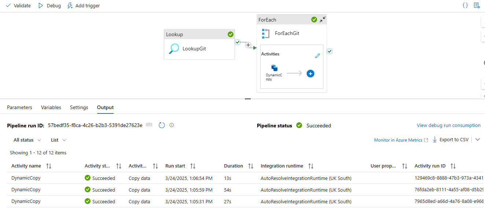
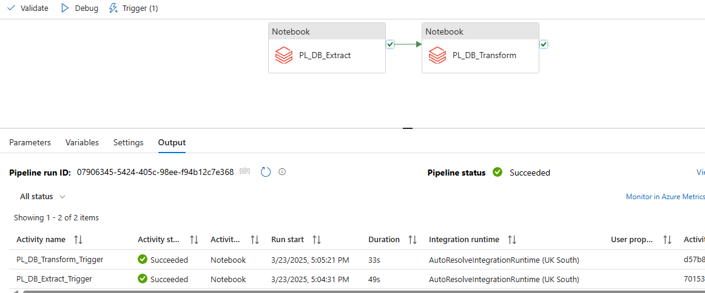
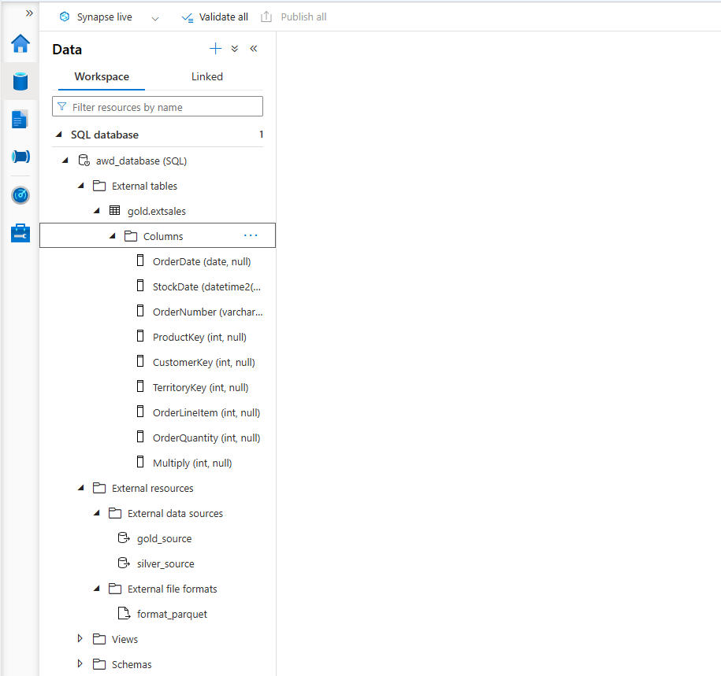

# Advanture Works
## Overview
This project focuses on building a comprehensive Extract, Transform, and Load (ETL) pipeline leveraging the robust functionalities of Microsoft Azure. The pipeline is designed to efficiently fetch data from Azure Blob Storage perform necessary transformations using Azure Databricks and Azure Data Factory

## Prerequisites
Microsoft Azure Subscription

Azure Data Factory: 

Azure Data Lake Gen2 Storage: 

Azure Databricks: 

ETL flow:
Extract Data: Retrieve CSV data from github Repo for processing and load it to Azure Data Lake Storage Gen-2
Transform Data: Utilize PySpark on Azure Databricks to analyze and process the data, storing the results in Azure Data Lake Storage Gen2
Load Data: Transfer the processed data into an Azure Synapse for Reporting

pipeline 1:

pipeline 2:

Azure Synapse Analytics:
Create Schema
Create Views
Create External data sources and file formats
