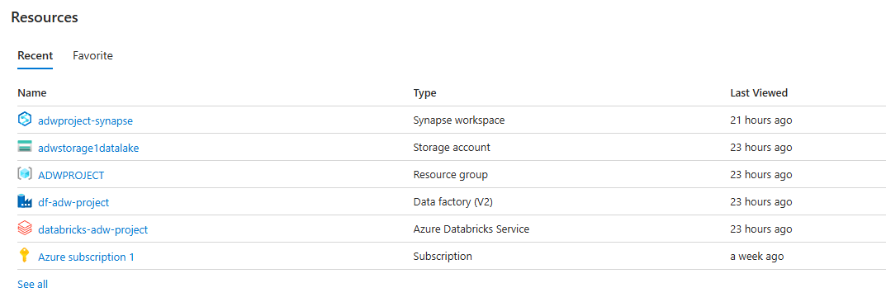

# Advanture Works
## Overview
This project focuses on building a comprehensive Extract, Transform, and Load (ETL) pipeline leveraging the robust functionalities of Microsoft Azure. The pipeline is designed to efficiently fetch data from Azure Blob Storage perform necessary transformations using Azure Databricks and Azure Data Factory

## Prerequisites
Microsoft Azure Subscription
Azure Blob Storage: 
Azure Data Lake Gen2 Storage: 
Azure Databricks: 
Azure SQL Server: 
Azure SQL Database: 
Azure Data Factory: 

