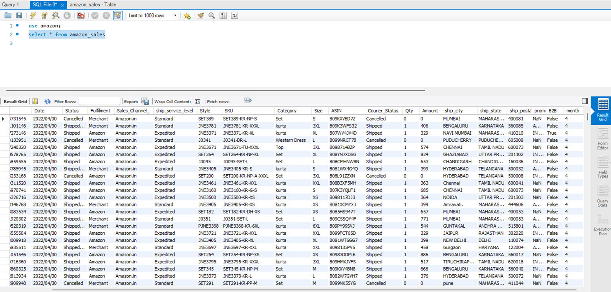
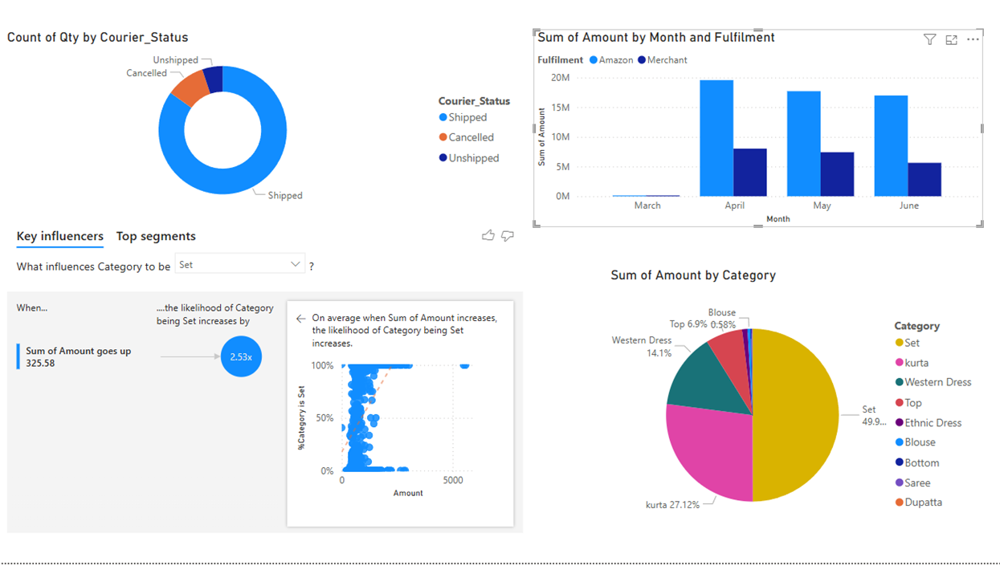
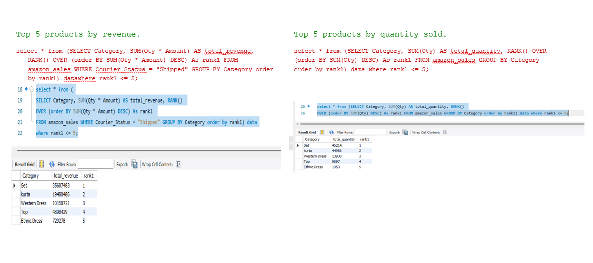

## E-Commerce Analysis using Pandas and SQL: Visualisation using power BI

This project uses an e-commerce dataset. The dataset includes transactional data from Amazon, providing detailed insights into sales trends, product performance, and fulfilment processes

## Phase 1: Data Exploration and Quality Check
Read data from csv file

## Identify Data Issues: 
1. Schema – Datatypes have been checked
2. There are nulls or missing values for Amount, Courier Status, promotion-ids, fulfilled-by, Unnamed: 22
3. Some columns are not required that can be dropped - 'Unnamed: 22', 'fulfilled-by', 'ship-country', 'currency’
4. Some columns are replaced with NaN if null - ['ship_city', 'ship_state', 'ship_postal_code', 'promotion_ids’]
5. Date formats are different that need to be reformatted

## Phase 2: Data Cleaning and Transformation 
1. Date is formatted across whole dataset
2. Month column is extracted
3. Amount is filled with Zero where it was null and status is cancelled
4. Unnecessary columns are dropped

## Phase 3: Business Questions and Insights

1. Category Performance: 
2. Seasonal Sales Trends:
3. Fulfillment Efficiency: 
4. Product Size Analysis:
5. Courier Impact on Revenue: 

## Phase 4: Advanced Reporting and Visualization 
1. Sales Leaderboard: 
2. Category Trends: 
3. Performance by Fulfillment:

## Expected Outputs 
1. Cleaned dataset. 
2. SQL scripts for analysis and transformation. 
3. An interactive dashboard for visualization. 