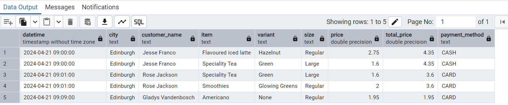

## Some of the functions like s3 and awsredshift, grafana cannot be visualise

## implemented a simple etl flow for the purpose to show my work without including S3, AWS and redshift.

# Coffee Shop ETL Pipeline

This project implements an end-to-end Extract, Transform, Load (ETL) pipeline for a coffee shop chain with multiple branches across the country (UK). The goal of this project is to centralize and analyze transactional data from all branches, enabling business insights through a scalable and efficient solution.

---

## **Project Overview**

### **Problem Statement**

The coffee shop chain faces challenges in consolidating and analyzing transactional data due to its current decentralized data setup. This makes it difficult to derive company-wide insights and generate actionable business intelligence.

### **Solution**

This project builds a robust ETL pipeline to:

-   Collect transaction data from individual branches via AWS S3. 
-   Transform raw data to align with a predefined schema.
-   Load the transformed data into an AWS Redshift data warehouse.
-   Visualize and analyze data using Grafana.

---

## **Architecture**

### **Technologies Used**

-   **AWS S3**: For storing raw transaction data.
-   **AWS Lambda**: For processing uploaded CSV files.
-   **AWS Redshift**: For centralized storage and querying of transformed data.
-   **Grafana**: For visualizing and analyzing data.
-   **Python**: For the ETL pipeline logic.
-   **Docker**: For local development and testing.

## **File Structure**

```plaintext
.
├── data # csv data
├── src
│   ├── app.py                     # Main Lambda function
│   ├── etl.py                     # Core ETL logic
│   ├── utils
│   │   ├── db_utils.py            # Database utilities
│   │   ├── s3_utils.py            # S3 utilities
│   │   └── sql_utils.py           # SQL utilities

```
### **Pipeline Steps**

1. **Data Extraction**

    - Upload daily CSV files containing transactional data to an S3 bucket.
    - Lambda function triggers on file upload to initiate processing.

2. **Data Transformation**

    - Parse and clean raw data to align with the Redshift schema.
    - Remove sensitive information such as credit card details.

3. **Data Loading**

    - Load transformed data into Redshift using Redshift SQL COPY commands.

4. **Data Visualization**
    - Connect Redshift to Grafana to enable query-based dashboards and insights.

5. **SQL database entry:**
